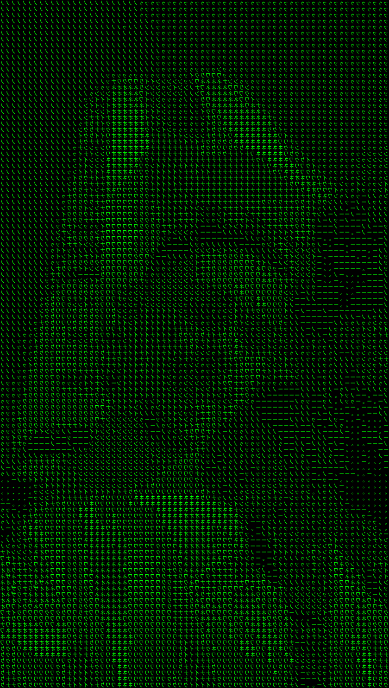

  

  

<h3 align="center">
  🔗 <b>Connect with me:</b>
    
  
  &nbsp;&nbsp;
  
</h3>

type=waving&height=120&color=A64CBF&section=footer&reversal=false&textBg=false&animation=fadeIn&fontAlignY=40&strokeWidth=0&descSize=0&descAlignY=59&fontSize=66&fontColor=EDA8FD)

